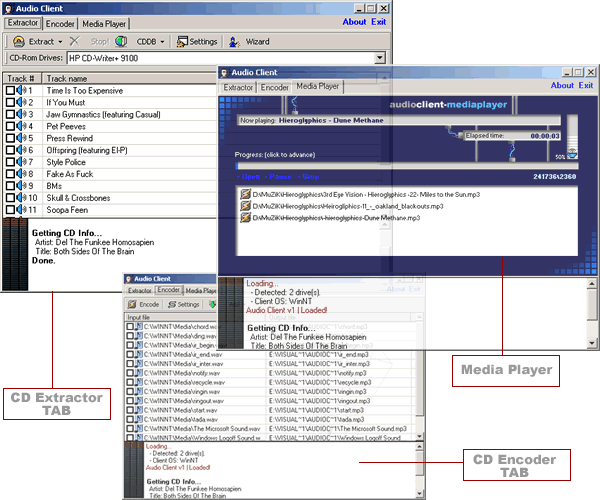



## Audio Client

### Description

Full featured CD Ripper/MP3 Encoder/MP3 Player. I threw this together in about 2 days so the code is a little messy. This will Extract tracks from your CD-ROM and convert them to Wav's. It also has the ability to automatically convert the wav to MP3. Once you have converted the files you can play them back with the program built-in media player (only MP3's right now). You could easily make the media player skinable by simply creating graphics for the BGPicture of the picturebox. (You'll understand when you see the code). You could also easily add alot more features with the DLL's that I have included. This uses LAME Encoder to encode the MP3's. Be sure to read the readme.txt to see what files to rename so that the program will work correctly.
 
### More Info
 

             |
---                |---
**Submitted On**   |2002-11-22 16:13:30
**By**             |[Mr\. Bishop](https://github.com/Planet-Source-Code/PSCIndex/blob/master/ByAuthor/mr-bishop.md)
**Level**          |Intermediate
**User Rating**    |4.7 (42 globes from 9 users)
**Compatibility**  |VB 4\.0 \(32\-bit\), VB 5\.0, VB 6\.0
**Category**       |[Sound/MP3](https://github.com/Planet-Source-Code/PSCIndex/blob/master/ByCategory/sound-mp3__1-45.md)
**World**          |[Visual Basic](https://github.com/Planet-Source-Code/PSCIndex/blob/master/ByWorld/visual-basic.md)
**Archive File**   |[Audio\_Clie15020711222002\.zip](https://github.com/Planet-Source-Code/mr-bishop-audio-client__1-40974/archive/master.zip)

